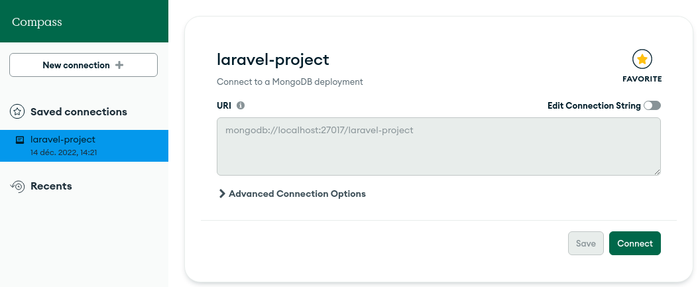

# Installation

# Fonctionnement
Pour que le projet fonctionne il est nécéssaire de passer par deux étapes :  
## Mongodb 📁
1. Ouvrir `mongodb compass` et inscrire comme URI : `mongodb://localhost:27017/laravel-project` comme ci-dessous 

2. Se connecter  
## Lancement du projet 🚀
1. Ouvrir le projet avec l'éditeur de texte de votre choix.
3. Ouvrir un premier terminal et y écrire `npm install`
2. et après que l'installation soit finis y écrire `npm run dev`
3. Ouvrir un deuxième terminal et y écrire `php artisan migrate`
4. Suivis de cette commande écrire `php artisan serve`

🍾 Dès maitenant le projet est fonctionnel et vous pouvez vous rendre sur l'url suivante : `http://127.0.0.1:8000/`  
⚠️N'oubliez pas d'ajouter des données dans mongodb compass sinon il n'y aura aucune donées à afficher⚠️
